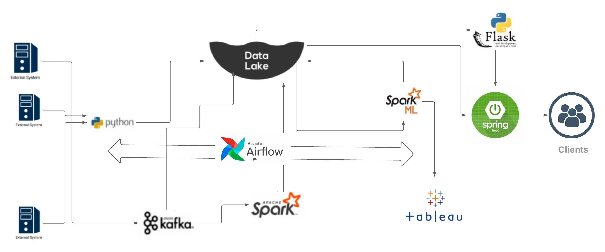

<div align="center">
    <h1>Continuous training of a Deep Learning Pipeline</h1>
</div>
<div align="center">
    <h3>Continuous data ingestion, continuous processing, scheduled retraining and <br>
                                     automated deployment</h3>
</div>

<div align="center">
    <h3>ShahidSalim</h3>
</div>
<div align="center">
    <h3>Data ScienceTech Institute</h3>
</div>
<div align="center">
    <h3>salim.shahid@edu.dsti.institute</h3>
</div>
<br>
<br>
<p>Following is a working example of a python based machine learning data pipeline. This fictional data
pipeline is created as a part of an e commerce recommendation system. The pipeline receives
clickstream information collected from different sources and trains a deep learning model ready to
generate recommendations for external systems. The complete process keeps repeating on a
scheduled interval using Apache Airflow in order to make more accurate machine models on newly
received input.</p>
<p>In the first stage the clickstream data is collected from various sources including web server
log and solr/elastic search. This data includes many types of user item interactions. A python script is
responsible to collect these data periodically from all different sources and dump that data into the
landing zone of our data lake. This data lake is created using Amazon S3 service. The data is stored
in the form of a CSV file as raw data and contains information from different sources which need to be
separated in a later stage.</p>
<p>When the raw data is made available it is pushed to kafka from where it is picked by Apache
Spark periodically. After some cleaning job the data is divided into groups according to its source and
other criteria. Each data group is then stored back to the data lake staging zone in parquet format.
Each data file is then picked for a machine learning task by a separate Apache Spark process using
Apache Hive. After the training is done a trained machine learning model is stored back to the data
lake analytics zone.</p>



<p>The trained models are used by a python task and the predictions are served to the external clients as <br>
REST service with help of flask.</p>
<p>In order to improve the accuracy of the system, this complete system is to be executed on scheduled
intervals with help of Apache Airflow . This way new data would be continuously kept ingested in the
system and new would get trained on bases of the newly received input data. The resulting deep
learning model would be made available for prediction without manual interaction.</p>


```python


```
